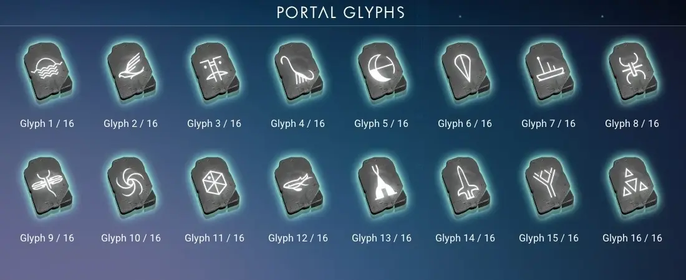
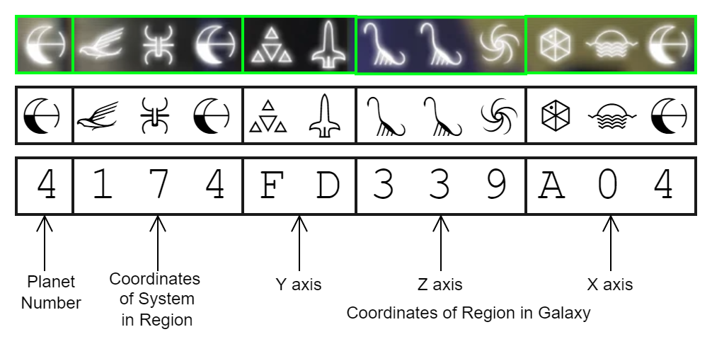

# No Man's Sky Interactive 3d Galaxy Map 
Using Computer Vision and Web Scraping to create interactive 3D maps of personally and collectively explored space in No Man's Sky.

Based on coordinates automatically generated on screen shots. 

Coordinates are marked as sequences of glyphs indicating X,Y,Z location and planet number. Need to recreate or modify OCR for glyph sequences with wide range of background images. 16 glyph alphabet needs to be recognized and translated to a hexadecimal sequence. Hex sequence then gets split into X, Y, & Z components. 

  

(Image: in game UI. Note index range is 0-15 (hex 0-F) in all other contexts)  

Personal Explored Space: User uploads standard, unedited screenshots.

'Global' Explored Space: 
Baseline - Based on images scraped from reddit.com/r/NMSCoordinteExchange 
Additional - Includes coordinates from systems mapped by all site users

Use neural network or other CV tool to recognize coordinates on images and parse coordinates into correct hexadecimal values. 

Decode hexadecimal sequence to extract X, Y, Z coordinates. 

(Image by author)

Plot map as stylized interactive 3d scatter plot.

## Expected Tools
- Python 
  - Pandas, Numpy, PyTorch, Plotly Dash
- TensorFlow, OpenCV 
  - possibly other, more appropriate ML/CV tools
- A transformer built on ImageNet
- Nvidia RAPIDS suite for GPU acceleration
- Docker
- HTML, JS, CSS
- Default to Django, possibly React or some other framework

## Project Scope Tiers

### Stage 1. Proof of Concept - Personal Map
- Scan local directory of personal images
  - Identical format
  - Single galaxy, platform, & version
- Process images
- Extract coordinates
- Visualize with interactive plot 
  - base plotly

### Stage 2. Dashboard UI
- Upgrade to modular dahsboard UI
  - Plotly Dash
- Modular design for efficient addition of later features
- Plotly Dash (or other framework that easily extends to web applications)

### Stage 2. Feature: Collective Map
- Scrape reddit for a collection of images 
- Start with only initial galaxy, pc platform, & update 3.94
- Include overlaid map and separate personal/collective map

### Stage 3. Scale Increase
- Add images

### Stage 3. Publish to Web Application   
- Containerisation w/ Docker  
- Basic web interface 

### Stage 4. Upgrade with Miscellanous Optional Features  
- Identify most isolated regions and generate random coordinates to attempt jumping to unexplored space. 
- Find an efficient way to make it so you can hover over points and see the image(s) related to that point.
- Scrape with flair searches to add filterable attributes like galaxy, subject, platform
- Use subject specific scraped images to train a transformer to differentiate between base, ship, multitool, freighter, and flora/fauna.

